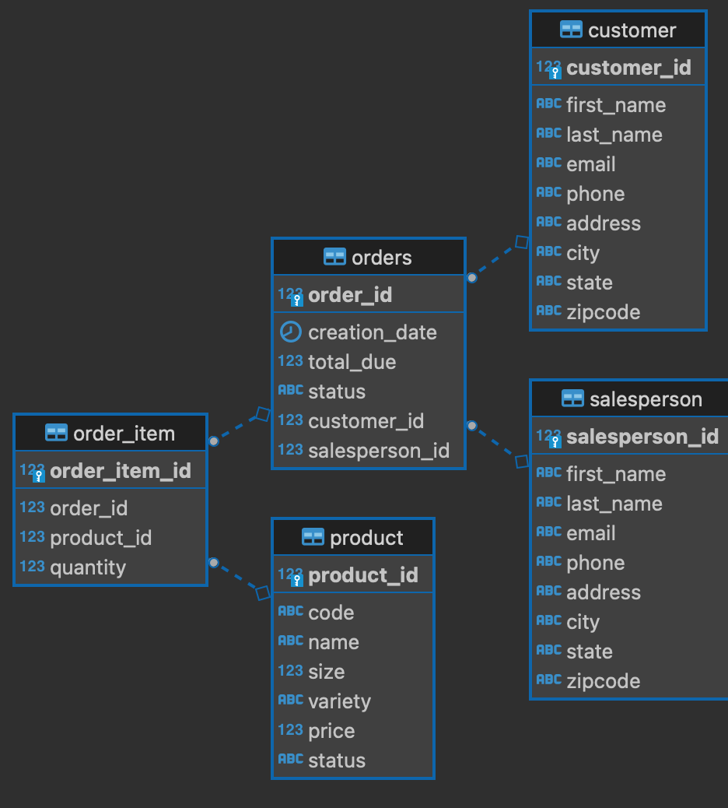

# JAVA DATABASE CONNECTIVITY
## Introduction
This tool allows the user to create a connection between a Java application and an RDBMS in order to run queries on a database and in turn process the result set for data analysis. The JDBC app was implemented following the Data Access Object (DAO) design pattern.

### Technologies Used:
* Java
* JDBC
* PostgreSQL
* PSQL Client
* Maven
* IntelliJ IDEA
* Docker
* Git

## Implementation
### ER Diagram:

## Design Patterns

There is more than one way to utilize JDBC. The two main ones are the DAO design pattern and the repository design pattern.

### DAO Design Pattern:
The Data Access Object design pattern allows to isolate the application/business layer from the persistence layer by way of an abstract API. This design pattern allows the API to be hidden from the application all the underlying functionality of performing CRUD operations. In this JDBC implementation the 'CustomerDAO' class was implemented to enable CRUD operations on a PostgreSQL database, 'hplussport'. Thereafter, a Data Transfer Object (DTO), namely 'Customer' class was created to represent a relation (i.e. Customer table) within the database. Finally, CRUD operations were performed in the 'JDBCExecutor' class to process the data.

### Repository Design Pattern:
The repository design pattern is similar to the DAO design pattern but it differs from it in that it is closer to the business logic of an app. Furthermore, the repository pattern allows for sharding of a database. 

## Test
The application had been tested manually against the database. An instance of a test database was created where the crud operations were performed on it to verify if the results matched the expected results.