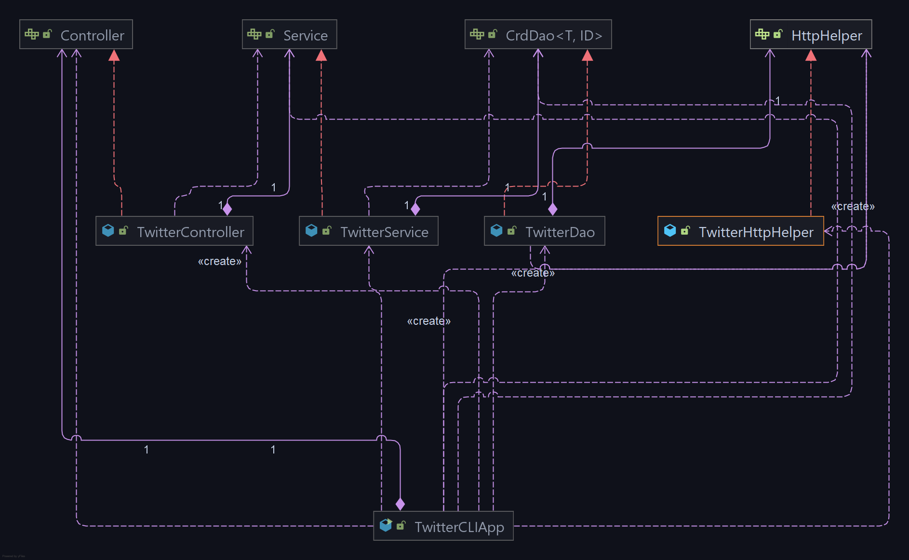

# JAVA TWITTER APP

## Introduction
Designed a java based Twitter application that allows the user to post a tweet, show a tweet and delete
a tweet through the use of Twitter's RESTful API's.

### Technologies Used:
* Java
* Twitter REST API's
* OAuthConsumer
* HttpClient
* Jackson
* JUnit4
* Spring Boot Framework
* Maven
* Docker
* Git
* IntelliJ IDEA

# Quick Start
**Package the app using Maven:**
```bash
mvn clean package
```
**Run the application using Docker:**
```bash
docker run --rm \
-e consumerKey=YOUR_VALUE \
-e consumerSecret=YOUR_VALUE \
-e accessToken=YOUR_VALUE \
-e tokenSecret=YOUR_VALUE \
therealskyz/twitter "post|show|delete" [options]
```
***The following are arguments to the Twitter App:***
* `consumerKey`: Consumer Key for Twitter REST API authentication.
* `consumerSecret:` Consumer Secret Key for Twitter REST API authentication.
* `consumerSecret:` Consumer Secret Key for Twitter REST API authentication.
* `accessToken`: Access Token for Twitter REST API authentication.
* `tokenSecret`: Secret Token for Twitter REST API authentication.
* `post|show|delete`: Post a tweet, show a tweet or delete a tweet.
* `[options]`: Various options depending on tweet argument:
  * `"post" "tweet text" "latitude:longitude"`
  * `"show" "tweet ID" "tweet fields"`
  * `"delete" "tweet ID's"`
  
# Design
The Twitter app follows the well known MVC(minus V) design pattern. The application consists of multiple layers that make up the 
architecture, namely the DAO Layer, Service Layer, Controller Layer and the Main Layer.
## UML Diagram


## explain each component(app/main, controller, service, DAO) (30-50 words each)
## TwitterDAO
The Data Access Object layer (DAO) is where the standard CRUD operations are executed against the underlying storage, and in this case
the Twitter REST API. It is in this layer where HTTP requests are made to the Twitter API endpoints by using an Http client implemented in the `TwitterHttpHelper` class. Endpoints like `/1.1/statuses/update.json` to make a `POST` request to post a `Tweet`, `/1.1/statuses/show.json` to make a `GET` request to show a `Tweet`, and lastly `/1.1/statuses/destroy/` endpoint to make a `POST` request to delete a `Tweet`. This layer also handles Tweet models (POJO's) that are utilized to make `Tweet` objects when making requests and receiving responses.

## TwitterService
The Service layer is where the business logic of a `Tweet` is implemented. This layer also calls the DAO layer in order to interact with the Twitter API. In order to post a `Tweet`, the tweet text string cannot exceed a character limit of 280 and the longitude and latitude values had to be in the range of -90 to 90 degrees and -180 to 180 degrees respectively. As for showing or deleting a `Tweet`, the corresponding tweet id's had to be 19 digits long.

## TwitterController
The Controller layer takes the user inputs from CLI and parses it. It then calls the service layer which returns the results as `Tweet` objects.

## TwitterCLIApp
The App/Main layer has the main method that creates the necessary components and chains the dependencies by calling the constructors of the underlying layers, i.e. `TwitterController`, `TwitterService`, `TwitterDAO`. In this layer, there is run method that executes certain methods based on user inputs.

## Models
Talk about tweet model

## Spring
- How you managed the dependencies using Spring?

# Test
How did you test you app using Junit and mockito?

## Deployment
How did you dockerize your app.

# Improvements
- Imporvement 1
- Imporvement 2
- Imporvement 3
```