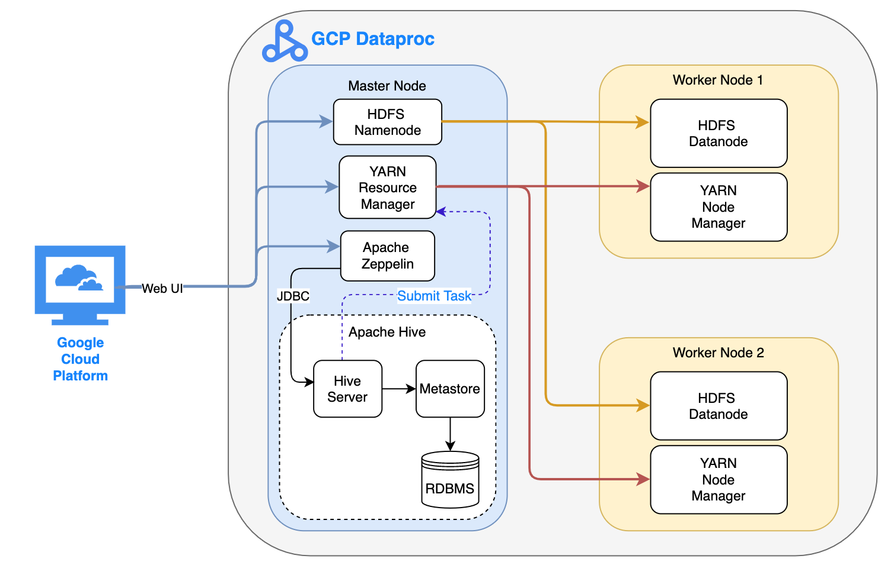
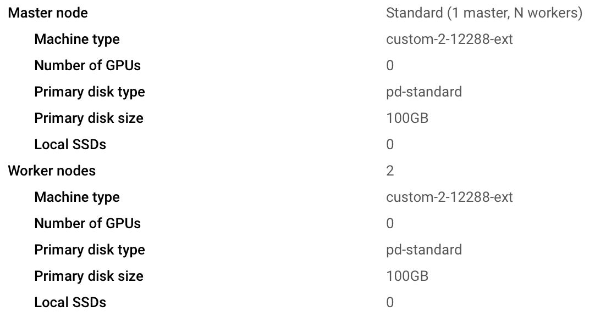

# Hadoop Project

## Introduction

Processed 'World Development Indicators (WDI)' data by utilizing big data tools within Apache Hadoop's ecosystem in order to derive meaningful insights.

### Technologies Used:

- Apache Hadoop
- Apache Zeppelin
- Apache Hive
- YARN
- HDFS
- Google Cloud Platform (GCP)

# Hadoop Cluster

## Cluster Architecture:

## Hardware Specifications:

## Big Data Tools:

- **HDFS:** The 'Hadoop Distributed Filesystem' is Hadoops implementation of a distributed filesystem for big data processing. Data is required to be partitioned across a network of computers (i.e. Cluster) so that it can be processed. It is necessary to partition a dataset across a number of machines in a network when it outgrows the storage capacity of a single machine.Filesystems that manage the storage across a network of machines are called distributed filesystems. File sizes in gigabytes, terabytes or even petabytes can only be processed in a network of machines. HDFS is the cluster's storage layer and is the base layer of big data processing.
  - In HDFS, there are two types of nodes, **Namenode** and **Datanode** which work in a master-worker relationship:
    - **Namenode (Master):** Knows the datanodes on which all the blocks for a given file are located.
    - **Datanode (Worker):** Stores and retrieve blocks of data when they are told to by the namenode.
- **YARN:** Hadoop's 'Yet Another Resource Negotiator' is Hadoop’s cluster resource management system. It enables managing of resources and scheduling of jobs in Hadoop. It runs on top of HDFS as the cluster's compute layer.
  - YARN has 2 core services, **Resource Manager** and **Node Manager** that are in a Master-Slave relationship:
    - **Resource Manager (Master):** Runs on one node per cluster. Manages the use of resources across the cluster.
    - **Node Manager (Slave):** Running on all the nodes in the cluster to launch and monitor containers. A container executes an application-specific process with a constrained set of resources (memory, CPU, and so on).
  - To run an application on YARN, a client contacts the resource manager and asks it to run an **application master (AM)** process. The resource manager then finds a node manager that can launch the application master in a **container**. The AM requests containers from the resource manager, and uses them to run YARN applications.
- **Hive:** Apache Hive is a framework for data warehousing on top of Hadoop. Hive makes it possible for analysts with strong SQL skills to run queries on huge volumes of data to process it without having to program MapReduce applications on Java.
  - Connection to hive server can be made via 'Beeline' which is a CLI tool that is a JDBC wrapper or with Zeppelin which also is a JDBC wrapper but provides a web UI.
  - The hive server connects to a 'Metastore' which contains the hive tables metadata.
  - The metastore data is stored in an RDBMS.
- **Zeppelin:** Apache Zeppelin is a web-based notebook that enables data-driven, interactive data analytics and collaborative documents with SQL, Scala, Python, R and more. It enables data visualization through hive queries and saves them for analysis.

# Hive Project

# Improvements

1. Optimize queries as much as possible to reduce time of execution as well as reduce file size.
2. Use other execution engines instead of default Tez, like Spark.
3. Do more queries to generate more meaningful insights.
