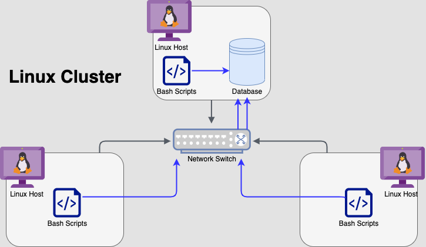

# LINUX CLUSTER MONITORING AGENT

## Introduction

**The monitoring agent tool enables the user to
monitor nodes of a Linux cluster. The tool
collects hardware specification data and hardware usage data of each node in the cluster
in real-time and stores it in a 
database. The data can be analyzed to generate reports for future resource planning purposes (e.g. add/remove servers).**

### Technologies Used:
* Git
* Docker
* Bash
* PostgreSQL
* PSQL client tool

## Quick Start
**Start a psql instance using psql_docker.sh:**
```bash
./scripts/psql_docker.sh start
```
**Create tables using ddl.sql:**
```bash
psql -h psql_host -U psql_user -d db_name -f sql/ddl.sql
```
**Insert hardware specs data into the DB using host_info.sh:**
```bash
./scripts/host_info.sh psql_host psql_port db_name psql_user psql_password
```
**Insert hardware usage data into the DB using host_usage.sh:**
```bash
./scripts/host_usage.sh psql_host psql_port db_name psql_user psql_password
```
**Crontab setup:**
```bash
* * * * * bash /home/centos/dev/linux_sql/host_agent/scripts/host_usage.sh psql_host psql_port db_name psql_user psql_password > /tmp/host_usage.log
```

# Implementation

## Architecture


## Scripts & Usage

### Database & Table Initialization:
**In order to collect host hardware data and host usage**
**data, a PostgreSQL instance must first be initialized alongside**
**the creation of 'host_info' and 'host_usage' tables.**

### psql_docker.sh:

*Create a Docker PostgreSQL container
if it doesn't exist using 'create' as argument to script.
If a Docker container does exist, then simply start or stop the container with either 'start' / 'stop'
as arguments to the script.*

```bash
#Initialize a PostgreSQL instance using Docker container
#The official PostgreSQL image for Docker container is provided in the following link: https://hub.docker.com/_/postgres
./scripts/psql_docker.sh create db_username db_password

#Connect to psql client and create tables 'host_info' and 'host_usage', make sure to create a database 'host_agent' before executing the following command
psql -h localhost -U postgres -d host_agent -f sql/ddl.sql
```

### Monitoring Agent - host_info.sh, host_usage.sh and crontab:
**In order to record hardware specifications data and usage data in real-time, a monitoring agent**
**consisting of a 'host_info' and 'host_usage' script and a crontab job was developed.** 

### host_info.sh:

*Run on each node of the cluster once to collect
hardware specifications data of the computer.*

```bash
#Collect hardware specification data once per node and store it into 'host_info' table
#Note: PostgreSQL port number is 5432
./scripts/host_info.sh psql_host psql_port db_name psql_user psql_password
```

### host_usage.sh:

*Run on each node of the cluster to collect resource
usage data of the computer.*

```bash
#Collect resource usage data per node and store it into 'host_usage' table
./scripts/host_usage.sh psql_host psql_port db_name psql_user psql_password
```

### crontab.sh:

*Run to enable repeated execution of the 'host_usage' script in order
to collect usage data every one minute increment.*

```bash
#Create and edit crontab job
crontab -e

#Repeatedly execute host_usage.sh every minute and redirect the stdout and stderr to the log file
#Add the following command to the crontab job
#Note: The crontab job requires the full path to the script so the path will vary
* * * * * bash /home/centos/dev/linux_sql/host_agent/scripts/host_usage.sh localhost 5432 host_agent postgres password > /tmp/host_usage.log

#Verify the script is running successfully
cat /tmp/host_usage.log
```

### Data Analysis:
**Analyze the stored data to determine if more nodes/servers need to be added or removed.**
 
### queries.sql:

*Contains SQL queries to help the user keep track of and manage the cluster.*

```bash
#Run SQL queries on the stored data in 'host_info' and 'host_usage' tables to analyze it for sound decision-making.
psql -h localhost -U postgres -d host_agent -f sql/queries.sql
```
## Database Modeling

### Host_info Schema:

id | hostname | cpu_number | cpu_architecture | cpu_model | cpu_mhz | L2_cache | total_mem | timestamp 
--- | --- | --- | --- | --- | --- | --- | --- | ---
Serial, **Primary Key**, Not Null | Varchar, Unique, Not Null | Integer, Not Null | Varchar, Not Null | Varchar, Not Null | Float(3), Not Null | Integer, Not Null | Integer, Not Null | Timestamp, Not Null

### Host_usage Schema:

timestamp | host_id | memory_free | cpu_idle | cpu_kernel | disk_io | disk_available
--- | --- | --- | --- | --- | --- | --- |
Timestamp, Not Null | Serial, **Foreign Key (host_info - id)**, Not Null | Integer, Not Null | Integer, Not Null | Integer, Not Null | Integer, Not Null | Integer, Not Null |

# Test
**A minimum viable product (MVP) had been created to test the tool on a single node. The idea behind this
method is that if it works as expected on a single node in the cluster then it should work on all nodes.** 

### Bash Scripts Test:
The bash scripts had been tested by executing the scripts manually and thereafter verifying the results by
comparing them to what was expected.

### Queries Test:
The SQL queries had been tested by comparing the results with test values.

# Deployment
**The application had been deployed by using the following technologies:**
* **Bash Script:** Bash scripts were created to automate specific processes, i.e. starting/stopping Docker container, extracting host data, etc.
* **crontab:** An essential technology that allowed for real-time monitoring of host resource usage.
* **GitHub:** Allowed for version control of features via remote repository.
* **Docker:** PostgreSQL database instance was initialized using Docker containers.

# Improvements
**Some improvements that could be made to the tool:**
1. Write a script that could handle hardware updates.
2. Automate more processes to make it more user-friendly and more time-efficient.
3. Create another table to list the history of hardware failures that would help in determining node hardware upgrades.

